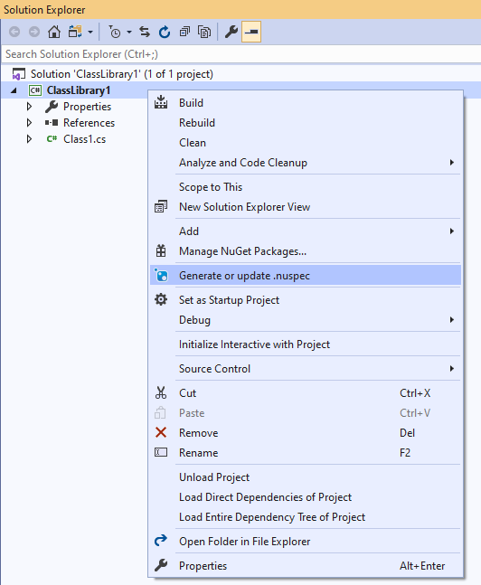

# NuspecGenerator

Download this extension from the [Visual Studio Marketplace](http://vsixgallery.com/extension/)
or get the [CI build](http://vsixgallery.com/extension/).

---------------------------------------

A Visual Studio Extension that helps generate nuspec files including dependencies for Non-SDK-style .NET Framework projects

See the [change log](CHANGELOG.md) for changes and road map.

## Features

- Generate or update .nuspec file from project menu

### Generate or update .nuspec file from project menu
Select a project and right click.

Then click on "Generate or update .nuspec" in the menu. A .nuspec file will be generated or updated.

## Contribute
Check out the [contribution guidelines](CONTRIBUTING.md)
if you want to contribute to this project.

## License
[MIT](LICENSE)